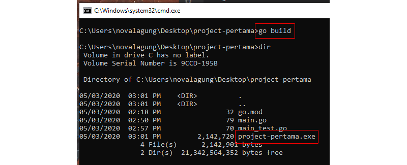

# A.5. Command

Pengembangan aplikasi Go tak jauh dari hal-hal yang berbau CLI atau *Command Line Interface*. Proses inisalisasi projek, kompilasi, testing, eksekusi program, semuanya dilakukan lewat command line.

Go menyediakan command `go`, dan pada bab ini kita akan mempelajari beberapa diantaranya.

> Pada bab ini pembaca tidak harus praktek, cukup pelajari saja untuk tahu. Mengenai praktek sendiri akan dimulai pada bab selanjutnya, yaitu [A.6. Program Pertama: Hello World](6-hello-world.md).

## A.5.1. Command `go mod init`

*Command* `go mod init` digunakan untuk inisalisasi projek pada Go (menggunakan Go Modules). Untuk nama projek bisa menggunakan apapun, tapi umumnya adalah disamakan dengan nama direktori.

Nama projek ini penting karena nantinya berpengaruh pada *import path sub packages* yang ada dalam projek tersebut.

```
mkdir <nama-project>
cd <nama-project>
go mod init <nama-project>
```

## A.5.1. Command `go run`

*Command* `go run` digunakan untuk eksekusi file program (file ber-ekstensi `.go`). Cara penggunaannya dengan menuliskan *command* tersebut diikut argumen nama file.

Berikut adalah contoh penerapan `go run` untuk eksekusi file program `main.go` yang tersimpan di path `project-pertama` yang path tersebut sudah diinisialisasi menggunakan `go mod init`.

```bash
cd project-pertama
go run main.go
```


*Command* `go run` hanya bisa digunakan pada file yang nama package-nya adalah `main`. Lebih jelasnya dibahas pada bab selanjutnya ([A.6. Program Pertama: Hello World](6-hello-world.md)).

Jika ada banyak file yang package-nya `main` dan file-file tersebut berada pada satu direktori level dengan file utama, maka eksekusinya adalah dengan menuliskan semua file sebagai argument *command* `go run` (lebih jelasnya akan dibahas pada bab 25). Contohnya bisa dilihat pada kode berikut.

```bash
go run main.go library.go
```


## A.5.2. Command `go test`

Go menyediakan package `testing`, berguna untuk keperluan unit test. File yang akan di-test harus ber-suffix `_test.go`.

Berikut adalah contoh penggunaan *command* `go test` untuk testing file `main_test.go`.

```bash
go test main_test.go
```


## A.5.3. Command `go build`

*Command* ini digunakan untuk mengkompilasi file program.

Sebenarnya ketika eksekusi program menggunakan `go run`, terjadi proses kompilasi juga. File hasil kompilasi akan disimpan pada folder temporary untuk selanjutnya langsung dieksekusi.

Berbeda dengan `go build`, *command* ini menghasilkan file *executable* atau *binary* pada folder yang sedang aktif. Contohnya bisa dilihat pada kode berikut.



Pada contoh di atas, projek `program-pertama` di-build, menghasilkan file baru pada folder yang sama, yaitu `program-pertama.exe`, yang kemudian dieksekusi. *Default*-nya nama projek akan otomatis dijadikan nama *binary*.

Untuk nama executable sendiri bisa diubah menggunakan flag `-o`. Contoh:

```
go build -o <nama-executable>
go build -o program.exe
```

> Untuk sistem operasi non-windows, tidak perlu menambahkan suffix `.exe` pada nama *binary*

## A.5.4. Command `go get`

*Command* `go get` digunakan untuk men-download package. Sebagai contoh saya ingin men-download package Kafka driver untuk Go pada projek `project-pertama`.

```bash
cd project-pertama
go get github.com/segmentio/kafka-go
dir
```


Pada contoh di atas, `github.com/segmentio/kafka-go` adalah URL package kafka-go. Package yang sudah terunduh tersimpan dalam temporary folder yang ter-link dengan project folder dimana *command* `go get` dieksekusi, menjadikan projek tersebut bisa meng-*import* package terunduh.

Untuk mengunduh dependensi versi terbaru, gunakan flag `-u` pada command `go get`, misalnya:

```
go get -u github.com/segmentio/kafka-go
```

Command `go get` **harus dijalankan dalam folder project**. Jika dijalankan di-luar project maka akan diunduh ke pada GOPATH.

## A.5.5. Command `go mod tidy`

*Command* `go mod tidy` digunakan untuk memvalidasi dependensi. Jika ada dependensi yang belum ter-download, maka akan otomatis di-download.

## A.5.6. Command `go mod vendor`

Command ini digunakan untuk vendoring. Lebih detailnya akan dibahas di akhir serial chapter A, pada bab [A.58. Go Vendoring](A-58-go-vendoring.md).
