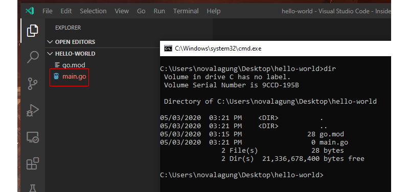
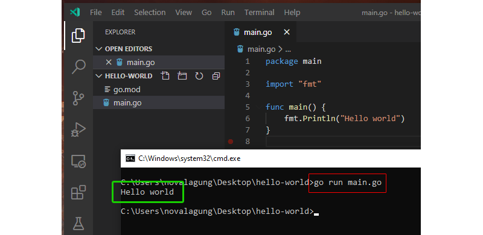

# A.6. Program Pertama: Hello World

Semua persiapan sudah selesai, saatnya mulai masuk pada sesi pembuatan program. Program pertama yang akan kita buat adalah aplikasi kecil yang menampilkan tulisan **Hello World**.

Di bab ini akan dijelaskan secara komprehensif step-by-step mulai dari awal. Mulai pembuatan project, pembuatan file program, sesi penulisan kode (coding), hingga eksekusi aplikasi.

## A.6.1. Load `GOPATH` Ke Editor

> Jika kawan-kawan menggunakan Go Modules, maka silakan langsung loncat ke step [A.6.3](#a63-menyiapkan-file-program), langsung drag saja folder projek ke editor atau IDE yang digunakan.

OK, hal pertama yang perlu dilakukan, adalah me-load atau memunculkan folder `GOPATH` di editor. Dengan begitu proyek-proyek Go akan lebih mudah di-maintain. Caranya:

 1. Buka editor yang digunakan.
 2. Cari menu untuk menambahkan projek, lalu pilih folder `GOPATH`. Untuk beberapa jenis editor bisa cukup dengan klik-drag folder tersebut ke editor.


> Nama variabel di sistem operasi non-Windows diawali dengan tanda dollar `$`, sebagai contoh `$GOPATH`. Sedangkan di Windows, nama variabel diapit karakter persen `%`, contohnya seperti `%GOPATH%`.

## A.6.2. Menyiapkan Folder Project

Selanjutnya, buat project folder baru dalam `$GOPATH/src`, dengan nama folder bebas (boleh menggunakan nama `belajar-golang` atau lainnya). Agar lebih praktis, buat folder tersebut lewat editor yang digunakan. Berikut adalah caranya.

 1. Klik kanan di folder `src`.
 2. Klik **New Folder**, di bagian bawah akan muncul inputan kecil **Folder Name**.
 3. Ketikkan nama folder, **belajar-golang**, lalu enter.


## A.6.3. Menyiapkan File Program

File program disini maksudnya adalah file yang berisikan kode program Go, berekstensi `.go`.

Di dalam project yang telah dibuat (`$GOPATH/src/belajar-golang/`), siapkan sebuah file dengan nama bebas, yang jelas harus ber-ekstensi `.go`. Pada contoh ini saya menggunakan nama file `bab6-hello-world.go`.

Pembuatan file program juga akan dilakukan lewat editor. Caranya silakan ikut petunjuk berikut.

 1. Klik kanan di folder `belajar-golang`.
 2. Klik **New File**, di bagian bawah akan muncul inputan kecil **File Name**.
 3. Ketikkan nama file, **belajar-golang**, lalu enter.



## A.6.4. Program Pertama: Hello Word

Setelah project folder dan file program sudah siap, saatnya untuk **coding**.

Dibawah ini merupakan contoh kode program sederhana untuk memunculkan text atau tulisan **"hello world"** ke layar output (command line). Silakan salin kode berikut ke file program yang telah dibuat. Sebisa mungkin jangan copy paste. Biasakan untuk menulis dari awal, agar cepat terbiasa dan familiar dengan Go.

```go
package main

import "fmt"

func main() {
    fmt.Println("hello world")
}
```

Setelah kode disalin, buka terminal (atau CMD bagi pengguna Windows), lalu masuk ke direktori proyek menggunakan perintah `cd`.

 - Windows

    ```bash
    $ cd %GOPATH%\src\belajar-golang
    ```

 - Non-Windows

    ```bash
    $ cd $GOPATH/src/belajar-golang
    ```


Jalankan program dengan perintah `go run`.

```bash
$ go run bab6-hello-world.go
```

Hasilnya, muncul tulisan **hello world** di layar console.



Selamat! Anda telah berhasil membuat program menggunakan Go!

---

Meski kode program di atas sangat sederhana, mungkin akan muncul beberapa pertanyaan di benak. Di bawah ini merupakan detail penjelasan kode di atas.

## A.6.5. Penggunaan Keyword `package`

Setiap file program harus memiliki package. Setiap project harus ada minimal satu file dengan nama package `main`. File yang ber-package `main`, akan di eksekusi pertama kali ketika program di jalankan.

Cara menentikan package dengan menggunakan keyword `package`, berikut adalah contoh penulisannya.

```go
package <nama-package>
package main
```

## A.6.6. Penggunaan Keyword `import`

Keyword `import` digunakan untuk meng-include atau memasukan package lain kedalam file program, agar isi package yang di-include bisa dimanfaatkan.

Package `fmt` merupakan salah satu package yang disediakan oleh Go, berisikan banyak fungsi untuk keperluan **I/O** yang berhubungan dengan text.

Skema penulisan keyword `import` bisa dilihat pada contoh berikut.

```go
import "<nama-package>"
import "fmt"
```

## A.6.7. Penggunaan Fungsi `main()`

Dalam sebuah proyek harus ada file program yang berisikan sebuah fungsi bernama `main()`. Fungsi tersebut harus berada dalam package yang juga bernama `main`. Fungsi `main()` adalah yang dipanggil pertama kali pada saat eksekusi program. Contoh penulisan fungsi `main`:

```go
func main() {

}
```

## A.6.8. Penggunaan Fungsi `fmt.Println()`

Fungsi `fmt.Println()` digunakan untuk memunculkan text ke layar (pada konteks ini, terminal atau CMD). Di program pertama yang telah kita buat, fungsi ini memunculkan tulisan **Hello World**.

Skema penulisan keyword `fmt.Println()` bisa dilihat pada contoh berikut.

```go
fmt.Println("<isi-pesan>")
fmt.Println("hello world")
```

Fungsi `fmt.Println()` berada dalam package `fmt`, maka untuk menggunakannya perlu package tersebut untuk di-import terlebih dahulu.

Fungsi `fmt.Println()` dapat menampung parameter yang tidak terbatas jumlahnya. Semua data parameter akan dimunculkan dengan pemisah tanda spasi.

```go
fmt.Println("hello", "world!", "how", "are", "you")
```

Outputnya: **hello world! how are you**.

---

<div class="source-code-link">
    <div class="source-code-link-message">Source code praktek pada bab ini tersedia di Github</div>
    <a href="https://github.com/novalagung/dasarpemrogramangolang-example/tree/master/chapter-A.6-hello-world">https://github.com/novalagung/dasarpemrogramangolang-example/.../chapter-A.6...</a>
</div>
