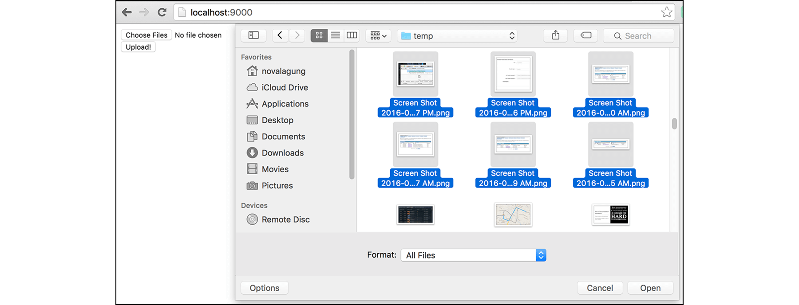

# B.16. AJAX Multiple File Upload

Pada bab ini, kita akan belajar 3 hal dalam satu waktu, yaitu: 

1. Bagaiamana cara untuk upload file via AJAX.
2. Cara untuk handle upload banyak file sekaligus.
3. Cara handle upload file yang lebih hemat memori.

Sebelumnya pada [Bab B.13. Form Upload File](/B-13-form-upload-file.html), pemrosesan file upload dilakukan lewat **ParseMultipartForm**, sedangkan pada bab ini metode yang dipakai berbeda, yaitu menggunakan **MultipartReader**. 

Kelebihan dari `MultipartReader` adalah, file yang di upload **tidak** di simpan sebagai file temporary di lokal terlebih dahulu (tidak seperti `ParseMultipartForm`), melainkan langsung diambil dari stream `io.Reader`.

Di bagian front end, upload file secara asynchronous bisa dilakukan menggunakan objek [FormData](https://developer.mozilla.org/en/docs/Web/API/FormData). Semua file dimasukkan dalam objek `FormData`, setelah itu objek tersebut dijadikan sebagai payload AJAX request.

## B.16.1. Struktur Folder Proyek

Mari langsung kita praktekkan, pertama siapkan proyek dengan struktur seperti gambar di bawah ini.


> Silakan unduh file js jQuery dari situs official jQuery.

## B.16.2. Front End

Buka `view.html`, siapkan template dasar view. Dalam file ini terdapat satu buah inputan upload file yang mendukung multi upload, dan satu buah tombol submit.

Untuk meng-enable kapabilitas multi upload, cukup tambahkan atribut `multiple` pada input file.

```html
<!DOCTYPE html>
<html>
	<head>
		<title>Multiple Upload</title>
		<script src="static/jquery-3.3.1.min.js"></script>
		<script>
			$(function () {
				// javascript code goes here
			});
		</script>
	</head>
	<body>
		<form id="user-form" method="post" action="/upload">
			<input required multiple id="upload-file" type="file" />
			<br />
			<button id="btn-upload" type="submit">Upload!</button>
		</form>
	</body>
</html>
```

Override event `submit` pada form `#user-form`, handler event ini berisikan proses mulai pembentukan objek `FormData` dari file-file yang telah di upload, hingga eksekusi AJAX.

```js
$("#user-form").on("submit", function (e) {
	e.preventDefault();

	var $self = $(this);
	var files = $("#upload-file")[0].files;
	var formData = new FormData();

	for (var i = 0; i < files.length; i++) {
		formData.append("files", files[i]);
	}

	$.ajax({
		url: $self.attr("action"),
		type: $self.attr("method"),
		data: formData,
		processData: false,
		contentType: false,
	}).then(function (res) {
		alert(res);
		$("#user-form").trigger("reset");
	}).catch(function (a) {
		alert("ERROR: " + a.responseText);
	});
});
```

Objek inputan files (yang didapat dari `$("#upload-file")[0].files`) memiliki property `.files` yang isinya merupakan array dari semua file yang dipilih oleh user ketika upload. File-file tersebut di-loop, dimasukkan ke dalam objek `FormData` yang telah dibuat.

AJAX dilakukan lewat `jQuery.ajax`. Berikut adalah penjelasan mengenai konfigurasi `processData` dan `contentType` dalam AJAX yang sudah dibuat. 

 - Konfigurasi `contentType` perlu di set ke `false` agar header Content-Type yang dikirim bisa menyesuaikan data yang disisipkan. 
 - Konfigurasi `processData` juga perlu di set ke `false`, agar data yang akan di kirim tidak otomatis dikonversi ke query string atau json string (tergantung `contentType`). Pada konteks ini kita memerlukan payload tetap dalam tipe `FormData`.

## B.16.3. Back End

Ada 2 route handler yang harus dipersiapkan di back end. Pertama adalah rute `/` yang menampilkan form upload, dan rute `/upload` untuk pemrosesan upload sendiri.

Buka file `main.go`, isi dengan package yang dibutuhkan, lalu lakukan registrasi dua rute yang dimaksud di atas, beserta satu buah rute untuk static assets.

```go
package main

import "fmt"
import "net/http"
import "html/template"
import "path/filepath"
import "io"
import "os"

func main() {
	http.HandleFunc("/", handleIndex)
	http.HandleFunc("/upload", handleUpload)
	http.Handle("/static/", 
		http.StripPrefix("/static/", 
			http.FileServer(http.Dir("assets"))))

	fmt.Println("server started at localhost:9000")
	http.ListenAndServe(":9000", nil)
}
```

Buat handler rute `/`, parsing template view `view.html`.

```go
func handleIndex(w http.ResponseWriter, r *http.Request) {
	tmpl := template.Must(template.ParseFiles("view.html"))
	if err := tmpl.Execute(w, nil); err != nil {
		http.Error(w, err.Error(), http.StatusInternalServerError)
	}
}
```

Sebelumnya, pada [Bab B.13. Form Upload File](/B-13-form-upload-file.html), metode yang digunakan untuk handle file upload adalah menggunakan `ParseMultipartForm`, file diproses dalam memori dengan alokasi tertentu, dan jika melebihi alokasi maka akan disimpan pada temporary file.

Metode tersebut kurang tepat guna jika digunakan untuk memproses file yang ukurannya besar (file size melebihi `maxMemory`) atau jumlah file-nya sangat banyak (memakan waktu, karena isi dari masing-masing file akan ditampung pada file *temporary* sebelum benar-benar di-copy ke file tujuan).

Solusinya dari dua masalah di atas adalah menggunakan `MultipartReader` untuk handling file upload. Dengan metode ini, file destinasi isinya akan di-copy lagsung dari stream `io.Reader`, tanpa butuh file temporary untuk perantara.

Kembali ke bagian perkodingan, siapkan fungsi `handleUpload`, isinya kode berikut.

```go
func handleUpload(w http.ResponseWriter, r *http.Request) {
	if r.Method != "POST" {
		http.Error(w, "Only accept POST request", http.StatusBadRequest)
		return
	}

	basePath, _ := os.Getwd()
	reader, err := r.MultipartReader()
	if err != nil {
		http.Error(w, err.Error(), http.StatusInternalServerError)
		return
	}

	// ...
}
```

Bisa dilihat, method `.MultipartReader()` dipanggil dari objek request milik handler. Mengembalikan dua objek, pertama `*multipart.Reader` dan `error` (jika ada).

Selanjutnya lakukan perulangan terhadap objek `reader`. Setiap file yang di-upload diproses di masing-masing perulangan. Setelah looping berakhir. idealnya semua file sudah terproses dengan benar.

```go
for {
	part, err := reader.NextPart()
	if err == io.EOF {
		break
	}

	fileLocation := filepath.Join(basePath, "files", part.FileName())
	dst, err := os.Create(fileLocation)
	if dst != nil {
		defer dst.Close()
	}
	if err != nil {
		http.Error(w, err.Error(), http.StatusInternalServerError)
		return
	}

	if _, err := io.Copy(dst, part); err != nil {
		http.Error(w, err.Error(), http.StatusInternalServerError)
		return
	}
}

w.Write([]byte(`all files uploaded`))
```

Method `.NextPart()` mengembalikan 2 informasi, yaitu objek stream `io.Reader` (dari file yg di upload), dan `error`. 

File destinasi dipersiapkan, kemudian diisi dengan data dari stream file, menggunakan `io.Copy()`.

Jika `reader.NextPart()` mengembalikan error `io.EOF`, menandakan bahwa semua file sudah di proses, maka hentikan perulangan.

OK, semua persiapan sudah cukup.

## B.16.4. Testing

Buka browser, test program yang telah dibuat. Coba lakukan pengujian dengan beberapa buah file.



Cek apakah file sudah terupload.


---

<div class="source-code-link">
    <div class="source-code-link-message">Source code praktek pada bab ini tersedia di Github</div>
    <a href="https://github.com/novalagung/dasarpemrogramangolang-example/tree/master/chapter-B.16-ajax-multi-upload">https://github.com/novalagung/dasarpemrogramangolang-example/.../chapter-B.16...</a>
</div>
