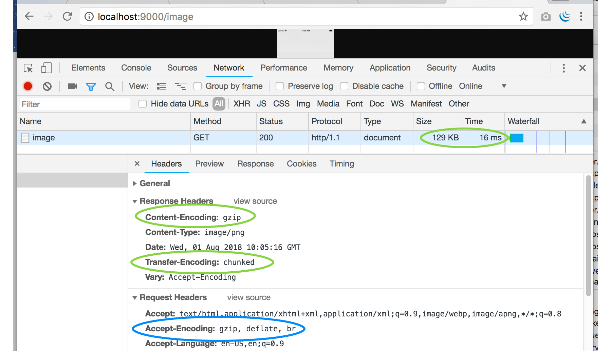

# C.15. HTTP Gzip Compression (gziphandler)

Pada bab ini kita akan mempelajari penerapan HTTP Compression, dengan encoding adalah Gzip, dalam aplikasi web golang.

## C.15.1. Teori

HTTP Compression adalah teknik kompresi data pada HTTP response, agar ukuran/size output menjadi lebih kecil dan response time lebih cepat.

Pada saat sebuah endpoint diakses, di header request akan ada header `Accept-Encoding` yang disisipkan oleh browser secara otomatis.

```http
GET /hello HTTP/1.1
Host: localhost:9000
Accept-Encoding: gzip, deflate
```

Jika isinya adalah `gzip` atau `deflate`, berarti browser siap dan support untuk menerima response yang di-compress dari back end.

> Deflate adalah algoritma kompresi untuk data lossless. Gzip adalah salah satu teknik kompresi data yang menerapkan algoritma deflate.

Di sisi back end sendiri, jika memang output di-compress, maka response header `Content-Encoding: gzip` perlu disisipkan.

```http
Content-Encoding: gzip
```

Jika di sebuah request tidak ada header `Accept-Encoding: gzip`, tetapi response back end tetap di-compress, maka akan muncul error di browser `ERR_CONTENT_DECODING_FAILED`.

## C.15.2. Praktek

Golang menyediakan package `compress/gzip`. Dengan memanfaatkan API yang tersedia dalam package tersebut, kompresi data pada HTTP response bisa dilakukan.

Namun pada bab ini kita tidak memakainya, melainkan menggunakan salah satu library middleware gzip compression yang cukup terkenal, [gziphandler](https://github.com/NYTimes/gziphandler).

Mari kita praktekan. Siapkan folder projek baru, siapkan satu buah rute `/image`. Dalam handler rute tersebut terdapat proses pembacaan isi file gambar `sample.png`, untuk kemudian dijadikan sebagai output data response. Gunakan file gambar apa saja untuk keperluan testing.

Tujuan dari aplikasi ini untuk melihat seberapa besar response size dan lama response time-nya. Nantinya akan kita bandingkan dengan hasil test di aplikasi yang menerapkan http gzip comporession.

```go
package main

import (
    "io"
    "net/http"
    "os"
)

func main() {
    mux := new(http.ServeMux)

    mux.HandleFunc("/image", func(w http.ResponseWriter, r *http.Request) {
        f, err := os.Open("sample.png")
        if f != nil {
            defer f.Close()
        }
        if err != nil {
            http.Error(w, err.Error(), http.StatusInternalServerError)
            return
        }

        _, err = io.Copy(w, f)
        if err != nil {
            http.Error(w, err.Error(), http.StatusInternalServerError)
        }
    })

    server := new(http.Server)
    server.Addr = ":9000"
    server.Handler = mux

    server.ListenAndServe()
}
```

Jalankan aplikasi lalu test hasilnya.


Image size adalah 137 KB, dan response time adalah 18 ms.

Selanjutnya kita akan coba menerapkan middleware gzip pada program kecil di atas. Pertama unduh dependency gziphandler terlebih dahulu menggunakan `go get`.

```bash
$ go get -u github.com/NYTimes/gziphandler
```

Import library yang sudah ter-unduh pada file main, lalu bungkus multiplexer `mux` menggunakan `gziphandler.GzipHandler()`, mux tersebut dimasukan ke property `server.Handler`.

```go
import (
    // ...
    "github.com/NYTimes/gziphandler"
)

func main() {
    // ...

    server.Handler = gziphandler.GzipHandler(mux)

    // ...
}
```

Jalankan ulang aplikasi, lihat perbandingannya.



Perbedannya size dan time nya mungkin tidak terlihat signifikan, karena memang gambarnya berukuran kecil, jumlahnya cuma satu asset, dan pengaksesannya di localhost. Untuk aplikasi yang sudah published di internet, dan diakses dari komputer lokal, pasti akan terasa jauh lebih cepat dan ringan.

## C.15.3. Gzip Compression di Echo

Penerapan http gzip compression di echo framework bisa dengan menggunakan middleware gziphandler di atas. Atau bisa juga menggunakan middleware gzip milik echo. Berikut merupakan contoh pemanfaatan echo middleware gzip.

```go
e := echo.New()

e.Use(middleware.Gzip())

e.GET("/image", func(c echo.Context) error {
    f, err := os.Open("sample.png")
    if err != nil {
        return err
    }

    _, err = io.Copy(c.Response(), f)
    if err != nil {
        return err
    }

    return nil
})

e.Logger.Fatal(e.Start(":9000"))
```

---

 - [Gzip Handler](https://github.com/NYTimes/gziphandler), by The New York Times team, Apache-2.0 license
 - [Echo](https://github.com/labstack/echo), by Vishal Rana (Lab Stack), MIT license

---

<div class="source-code-link">
    <div class="source-code-link-message">Source code praktek pada bab ini tersedia di Github</div>
    <a href="https://github.com/novalagung/dasarpemrogramangolang-example/tree/master/chapter-C.15-http-gzip-compression">https://github.com/novalagung/dasarpemrogramangolang-example/.../chapter-C.15...</a>
</div>
