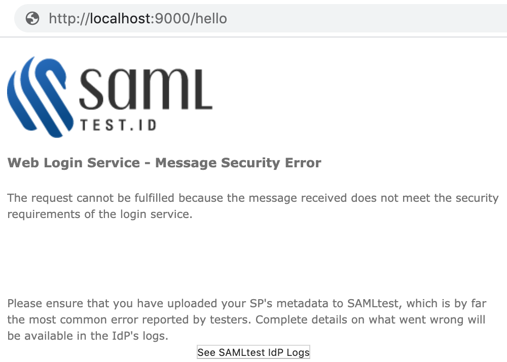
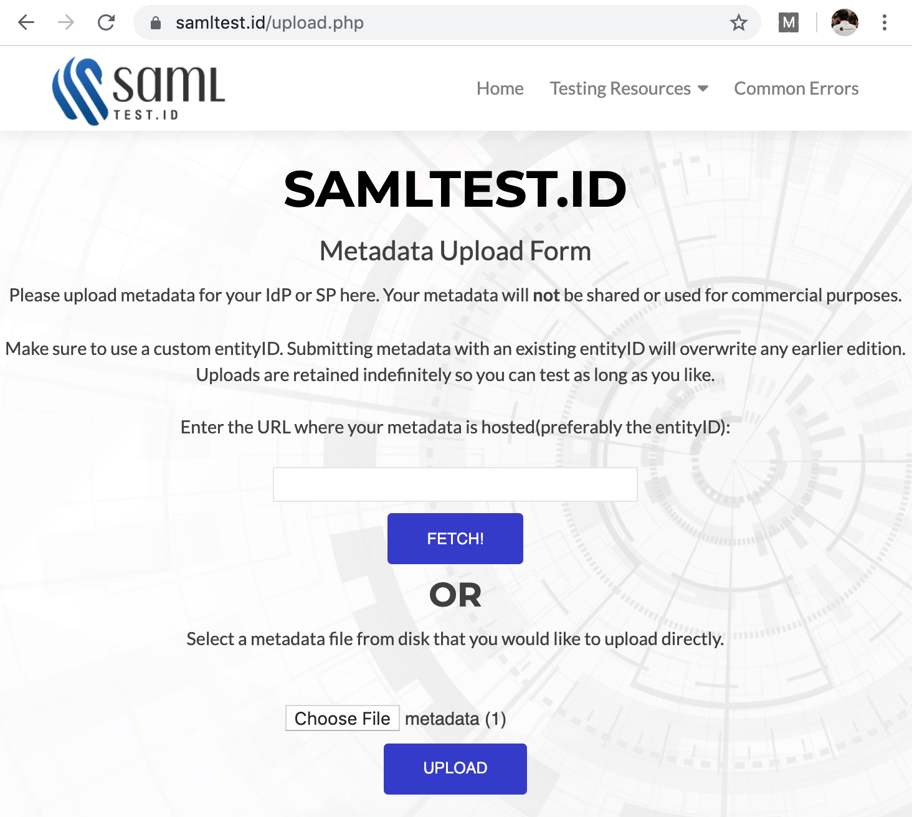

# C.34. SSO SAML 2.0 (Service Provider)

Kali ini topik yang dipilih adalah SAML SSO versi 2.0. Kita akan pelajari cara penerapan SSO di sisi penyedia servis (Service Provider), dengan memanfaatkan salah satu penyedia Identity Provider (IDP) gratisan yaitu [samltest.id](https://samltest.id).

> Pada bab ini kita fokus pada bagian Service Provider.

## C.34.1. Definisi

Sebelum kita masuk ke bagian tulis menulis kode, alangkah baiknya sedikit membahas tentang definisi dari SSO dan SAML itu sendiri.

#### • SSO

SSO atau Single Sign-On merupakan servis untuk otentikasi dan manajemen session. Dengan SSO, maka akses ke banyak aplikasi cukup bisa sekali otentikasi saja. Contoh SSO:

- Seorang pengguna ingin mengupload video di Youtube. Karena belum login, maka akan di redirect ke halaman SSO login milik Google.
- Setelah ia selesai dengan keperluannya, user ingin menge-cek email, maka dibukalah Gmail. Nah di bagian ini user tidak perlu untuk login lagi, karena Youtube dan Gmail menggunakan SSO untuk otentikasinya.
- Tak hanya Youtube dan Gmail, hampir semua produk Google terintegrasi dengan satu SSO.

> Umumnya, otentikasi pada SSO dilakukan dengan database user di (directory) server via protokol LDAP.

Ada beberapa jenis penerapan SSO yang bisa dipilih, salah satunya adalah **Security Assertion Markup Language** atau **SAML** yang akan kita bahas pada bab ini.

#### • SAML

SAML merupakan protokol open standard untuk otentikasi dan otorisasi antara penyedia layanan (**Service Provider**) dan penyedia identitas (**Identity Provider**). SAML berbasis *assertion* berupa XML.

> Service Provider biasa disingkat dengan **SP**, sedangkan Identity Provider disingkat **IDP**.

SAML adalah standar yang paling banyak digunakan dalam platform berbentuk layanan enterprise (Sass/PaaS), seperti Github, Atlassian JIRA, Sales Force menerapkan SAML pada platform mereka, lebih detailnya silakan cek https://en.wikipedia.org/wiki/SAML-based_products_and_services.

Dalam SAML, ada 3 buah role penting:

1. Manusia atau pengguna aplikasi (disini kita sebut sebagai *principal*)
2. Penyedia Layanan atau SP, contohnya seperti: Gmail, Youtube, GCP
3. Penyedia Identitas atau IDP, contoh: Google sendiri

> Penulis kurang tau apakah otentikasi pada Google menggunakan SAML atau tidak, tapi yang jelas mereka menerapkan SAML dan juga OpenID di beberapa service mereka. Di atas dicontohkan menggunakan produk Google, hanya sebagai analogi untuk mempermudah memahami SAML.

## C.34.2. Cara Kerja SAML

Agar lebih mudah dipahami, kita gunakan contoh. Ada dua buah website/aplikasi yang terintegrasi dengan satu buah SSO, yaitu: http://ngemail.com dan http://ndeloktipi.com. Kedua aplikasi tersebut merupakan SP atau Service Provider.

Aplikasi **ngemail** dan **ndeloktipi** menggunakan satu penyedia identitas yaitu http://loginomrene.com. Jadi **loginomrene** ini merupakan IDP atau Identity Provider.

#### 1. User request *target resource* ke SP

Suatu ketika ada sebuah user yang ingin mengakses **ngemail** untuk mengirim sebuah email ke temannya. User tersebut sudah terdaftar sebelumnya. User langsung mengakses url berikut di browser.

```
http://ngemail.com/ngirimemailsaiki
```

Yang terjadi ketika user browser website tersebut, si SP (dalam konteks ini **ngemail**) melakukan pengecekan ijin akses (disebut security context), apakah user ini sudah login atau belum. Karena belum login maka user diarahkan ke halaman otentikasi SSO.

> Target resource disini yang dimaksud adalah http://ngemail.com/ngirimemailsaiki

#### 2. SP merespon dengan URL untuk SSO login di IDP

Karena user belum memiliki ijin akses, maka SP membalas request dari browser tersebut dengan balasan berupa url halaman login SSO di IDP.

```
http://loginomrene.com/SAML2/SSO/Redirect?SAMLRequest=request
```

> Isi dari query string `SAMLRequest` adalah sebuah XML `<samlp:AuthnRequest>...</samlp:AuthnRequest>` yang di-encode dalam base64 encoding.

#### 3. Browser request laman SSO login ke IDP

Setelah aplikasi menerima balasan atas request pada point 1, dilakukan redirect ke URL halaman SSO login pada point 2.

IDP kemudian menerima request tersebut, lalu memproses `AuthnRequest` yang dikirim via query string untuk kemudian dilakukan security check.

#### 4. IDP merespon browser dengan menampilkan halaman login

Jika hasil pengecekan yang dilakukan oleh IDP adalah: user belum memiliki akses login, maka IDP merespon browser dengan menampilkan halaman login HTML.

```html
<form method="post" action="https://loginomrene.com/SAML2/SSO/POST" ...>
    <input type="hidden" name="SAMLResponse" value="response" />
    ...
    <input type="submit" value="Submit" />
</form>
```

> Isi dari input name `SAMLResponse` adalah sebuah XML `<samlp:Response></samlp:Response>` yang di-encode dalam base64 encoding.

#### 5. Submit POST ke SP untuk keperluan asertasi (istilahnya *Assertion Consumer Service*)

User kemudian melakukan login di halaman otentikasi SSO pada point 4, username password atau credentials di-isi, tombol submit di klik. Request baru di-dispatch dengan tujuan url adalah action url form tersebut. Pada point 4 bisa dilihat bahwa action url adalah berikut.

```
https://loginomrene.com/SAML2/SSO/POST
```

#### 6. SP merespon dengan redirect ke *target resource*

SP menerima request tersebut, kemudian mempersiapkan ijin akses/token (yang disebut *security context*). Setelahnya SP merespon request tersebut dengan redirect ke *target resource*, pada contoh ini adalah url http://ngemail.com/ngirimemailsaiki (url point 1).

#### 7. User request *target resource* ke SP

Pada bagian ini user melakukan request target resource ke SP untuk kedua kalinya setelah point pertama. Bedanya pada point pertama, requet dilakukan secara eksplisit olah user/browser, sedang kali ini request merupakan hasil redirect point 6.

```
http://ngemail.com/ngirimemailsaiki
```

Perbedaan kedua adalah, kali ini user memiliki ijin akses.

#### 8. SP merespon dengan balasan *target resource* yang diminta

Karena user memiliki security context, maka SP merespon dengan balasan berupa target resource yang diminta, walhasil halaman http://ngemail.com/ngirimemailsaiki muncul.

> Selanjutnya, setiap kali ada request target resource, maka point 7 dan 8 akan diulang.


## C.34.4. SAML Metadata

Dalam per-SAML-an duniawi, ada istilah *metadata*, yang memiliki peran sangat penting dalam komunikasi antar SP dan IDP dalam SAML.

Metadata merupakan sebuah XML berisi informasi penting mengenai SP dan IDP, yang juga sekaligus menjadi *unique identifier* ubaik ntuk SP dan juga IDP.

SP memiliki metadata, IDP juga punya. Nantinya kedua entitas ini akan bertukar metadata. Jadi SP akan memiliki metadata IDP, dan berlaku sebalikanya (IDP memiliki metadata SP).

Metadata diperlukan secara *mandatory* dalam operasi dan komunikasi antar SP dan IDP. Salah satu contoh kegunaannya bisa dilihat pada proses otentikasi. Informasi yang dikirim dari SP yang jelasnya ter-enkripsi, maka untuk bisa dibaca di sisi IDP, perlu untuk di-decrypt terlebih dahulu, hal ini membuat IDP wajib untuk tau public key yang digunakan oleh SP. Nah, dengan adanya pertukaran metadata, IDP akan tau key milik SP

> Metadata berisi informasi penting. Diantaranya adalah entity ID, key pair, protocol endpoints, dan lainnya.


Ada dua jenis metode pertukaran metadata, **static metadata exchange** dan **dynamic metadata exchange**. Yang kita terapkan pada pembahasan ini adalah yg static.

Ok, lanjut ke bagian praktek.

## C.34.3. Praktek & Persiapan

Sebelum masuk praktek, ada beberapa hal yang perlu penulis infokan. Yang akan kita praktekan adalah membuat entitas SP. Untuk IDP nya kita gunakan layanan IDP gratis dari samltest.id, untuk keperluan testing.

Disini kita gunakan library https://github.com/crewjam/saml untuk mempermudah proses kodingnya. Pastikan menggunakan rilis v0.4.0 atau minimal revisi #861266e.

Silakan buat 1 projek baru, lalu didalamnya generate *self-signed X.509 key pair* dengan menggunakan command berikut. Key pair ini diperlukan oleh SP dalam melakukan komunikasi dengan IDP.

```bash
mkdir chapter-c34
cd chapter-c34
go mod init chapter-c34
go get -u github.com/crewjam/saml@861266e
```

```bash
openssl req -x509 -newkey rsa:2048 -keyout myservice.key -out myservice.cert -days 365 -nodes -subj "/CN=localhost"
```

Setelah itu siapkan `config.go` yang isinya adalah beberapa konfigurasi.

```go
var (
	samlCertificatePath = "./myservice.cert"
	samlPrivateKeyPath  = "./myservice.key"
	samlIDPMetadata     = "https://samltest.id/saml/idp"

	webserverPort    = 9000
	webserverRootURL = fmt.Sprintf("http://localhost:%d", webserverPort)
)
```

Bisa dilihat, selain konfigurasi untuk web server, konfigurasi key pair juga ada. Dan satu lagi variabel konfigurasi `samlIDPMetadata` isinya yang mengarah ke sebuah url.

Seperti yang sudah di bahas di atas, bahwa untuk meng-enable SAML, perlu ada pertukaran metadata. Aplikasi yang kita buat ini (SP) wajib tau metadata IDP. Konfigurasi `samlIDPMetadata` berisi url download metadata IDP milik samltest.id.

## C.34.4. SAML Middleware

Buat `saml_middleware.go`, isinya sesuai petunjuk di github.com/crewjam/saml, berisi kode untuk setup objek saml. Pada pembuatan objek saml, beberapa konfigurasi (yang sudah kita siapkan) disisipkan.

```go
package main

import (
	"crypto/rsa"
	"crypto/tls"
	"crypto/x509"
	"net/url"

	"github.com/crewjam/saml/samlsp"
)

func newSamlMiddleware() (*samlsp.Middleware, error) {
	keyPair, err := tls.LoadX509KeyPair(samlCertificatePath, samlPrivateKeyPath)
    if err != nil { return nil, err }
    
	keyPair.Leaf, err = x509.ParseCertificate(keyPair.Certificate[0])
	if err != nil { return nil, err }

	idpMetadataURL, err := url.Parse(samlIDPMetadata)
    if err != nil { return nil, err }
    
	idpMetadata, err := samlsp.FetchMetadata(context.Background(), http.DefaultClient, *idpMetadataURL)
	if err != nil { return nil, err }

	rootURL, err := url.Parse(webserverRootURL)
	if err != nil { return nil, err }

	sp, err := samlsp.New(samlsp.Options{
		URL:         *rootURL,
		Key:         keyPair.PrivateKey.(*rsa.PrivateKey),
		Certificate: keyPair.Leaf,
		IDPMetadata: idpMetadata,
	})
	if err != nil { return nil, err }

	return sp, nil
}
```

## C.34.5. SAML SP App

Buat objek saml middleware, lalu jadikan sebagai handler dari endpoint `/saml/`. Endpoint ini merupakan reserved endpoint untuk SAML pada aplikasi SP kita.

```go
pckage main

import (
    "github.com/crewjam/saml/samlsp"
    // ...
)

func main() {
	sp, err := newSamlMiddleware()
	if err != nil {
		log.Fatal(err.Error())
    }
    
    http.Handle("/saml/", sp)
    // ...
}
```

Buat dua buah route handler, `/` dan `/hello`, lalu bungkus fungsi handler kedua routes dengan `sp.RequireAccount()`. Dengan ini akan membuat kedua endpoint ini hanya bisa diakses ketika user statusnya *authorized* atau sudah melakukan login.

```go
// ...
http.Handle("/index", sp.RequireAccount(
    http.HandlerFunc(landingHandler),
))
http.Handle("/hello", sp.RequireAccount(
    http.HandlerFunc(helloHandler),
))
// ...
```

Kemudian buat kedua fungsi handler routes di atas.

```go
func landingHandler(w http.ResponseWriter, r *http.Request) {
	name := samlsp.AttributeFromContext(r.Context(), "displayName")
	w.Write([]byte(fmt.Sprintf("Welcome, %s!", name)))
}
func helloHandler(w http.ResponseWriter, r *http.Request) {
	w.Write([]byte("Hello!"))
}
```

Terakhir start web server, lalu jalankan aplikasi.

```go
portString := fmt.Sprintf(":%d", webserverPort)
fmt.Println("server started at", portString)
http.ListenAndServe(portString, nil)
```

```bash
go run *.go
```

Oops, muncul error pada saat mengakses `http://localhost:9000/index`. Meski url ini merupakan protected url, yang dimana hanya bisa diakses ketika sudah login, harusnya user akan di-redirect ke halaman login, bukan malah memunculkan error.



Jika dilihat baik-baik, errornya cukup jelas, bahwa ini terjadi karena kita belum memberikan metadata SP aplikasi kita ke IDP. Ingat bahwa pertukaran metadata adalah wajib, SP sudah tau metadata IDP, tapi IDP belum tau metadata SP.

Ok, sekarang kita perlu upload metadata SP ke samltest.id. Metadata SP bisa di-unduh lewat endpoint `/saml/metadata` (pada konteks ini url menjadi http://localhost:9000/saml/metadata. URL upload metadata samltest adalah https://samltest.id/upload.php.



## C.34.6. Test SAML SP

Test dengan membuka endpoint `/index` pada browser. Idealnya kita akan diarahkan ke URL SAML login. Gunakan sandbox account yang ada di halaman itu untuk login.


Setelah login sukses, halaman yang diinginkan muncul dengan menampilkan pesan `Welcome, Nama User!`.

Informasi nama user tersebut diambil dari objek context route handler, yg informasinya disisipkan oleh saml middleware. Contoh pengambilan informasi user bisa dilihat dalam handler `indexHandler`:

```go
name := samlsp.AttributeFromContext(r.Context(), "displayName")
```

## C.34.7. SSO Multiple SP Apps

Ada dua pilihan metode inisialisasi SSO pada SAML: *SP-initiated SSO* dan *IDP-initiated SSO*.

Pada contoh yg kita terapkan, *SP-initiated SSO* dipergunakan. Setiap user request akan melewati proses otentikasi dahulu ke IDP sebelum akhirnya diperbolehkan mengakses SP.

Salah satu benefit metode inisialisasi ini: ketika ada banyak aplikasi SP (misal ada 3 aplikasi) yang kesemuanya berkomunikasi dengan satu IDP yang sama (misal samltest.id), maka Single Sign-on akan ter-enable *seamlessly*. Ketika kita login di salah satu aplikasi SP, maka pada aplikasi SP lainnya tidak perlu login lagi.

---

 - [crewjam/saml](https://github.com/crewjam/saml), by Ross Kinder, BSD-2-Clause License

---

<div class="source-code-link">
    <div class="source-code-link-message">Source code praktek pada bab ini tersedia di Github</div>
    <a href="https://github.com/novalagung/dasarpemrogramangolang-example/tree/master/chapter-C.34-sso-saml-sp">https://github.com/novalagung/dasarpemrogramangolang-example/.../chapter-C.34...</a>
</div>
