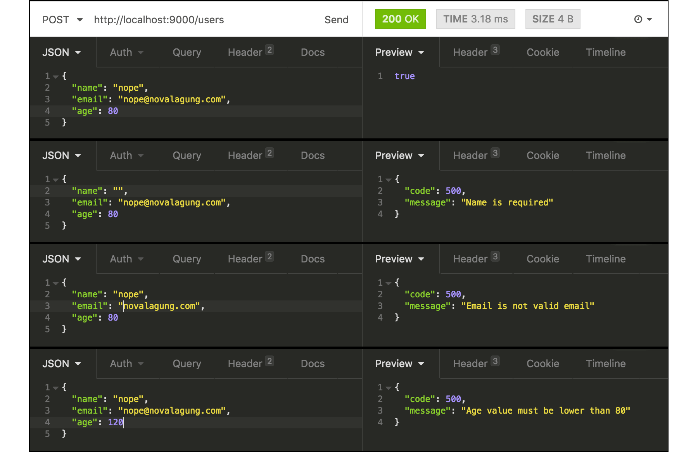

# C.6. HTTP Error Handling (Validator v9, Echo)

Pada chapter ini kita akan belajar cara membuat custom error handler yang lebih readable, sangat cocok untuk web service. Bahan dasar yang kita manfaatkan adalah source code pada chapter sebelum ini, lalu dimodifikasi. Jadi silakan salin project pada chapter sebelumnya sebagai projek folder baru.

## C.6.1. Error Handler

Cara meng-custom default error handler milik echo, adalah dengan meng-override property `e.HTTPErrorHandler`. Langsung saja override property tersebut dengan callback berisi parameter objek error dan context. Gunakan callback tersebut untuk bisa menampilkan error yg lebih detail.

```go
e.HTTPErrorHandler = func(err error, c echo.Context) {
    report, ok := err.(*echo.HTTPError)
    if !ok {
        report = echo.NewHTTPError(http.StatusInternalServerError, err.Error())
    }

    c.Logger().Error(report)
    c.JSON(report.Code, report)
}
```

Pada kode di atas, objek `report` menampung objek error setelah di casting ke tipe `echo.HTTPError`. Error tipe ini adalah error-error yang berhubungan dengan http, yang di-handle oleh echo. Untuk error yang bukan dari echo, tipe nya adalah `error` biasa. Pada kode di atas kita standarkan, semua jenis error harus berbentuk `echo.HTTPError`.

Selanjutnya objek error tersebut kita tampilkan ke console dan juga ke browser dalam bentuk JSON.

OK, jalankan aplikasi, lalu test hasilnya.


## C.6.2. Human-Readable Error

Error yang dikembalikan sudah bisa lebih detail dibanding sebelumnya, tapi masih kurang, karena masih susah untuk dipahami. Lakukan modifikasi pada callback custom error handler menjadi seperti pada kode berikut.

```go
e.HTTPErrorHandler = func(err error, c echo.Context) {
    report, ok := err.(*echo.HTTPError)
    if !ok {
        report = echo.NewHTTPError(http.StatusInternalServerError, err.Error())
    }

    if castedObject, ok := err.(validator.ValidationErrors); ok {
        for _, err := range castedObject {
            switch err.Tag() {
            case "required":
                report.Message = fmt.Sprintf("%s is required", 
                    err.Field())
            case "email":
                report.Message = fmt.Sprintf("%s is not valid email", 
                    err.Field())
            case "gte":
                report.Message = fmt.Sprintf("%s value must be greater than %s",
                    err.Field(), err.Param())
            case "lte":
                report.Message = fmt.Sprintf("%s value must be lower than %s",
                    err.Field(), err.Param())
            }

            break
        }
    }

    c.Logger().Error(report)
    c.JSON(report.Code, report)
}
```

Error yang dikembalikan oleh *validator.v9* bertipe `validator.ValidationErrors`. Pada kode di atas bisa kita lihat ada pengecekan apakah error tersebut adalah dari library *validator.v9* atau bukan; jika memang iya, maka `report.Message` diubah isinya dengan kata-kata yang lebih mudah dipahami.

Tipe `validator.ValidationErrors` sendiri sebenarnya merupakan slice `[]validator.FieldError`. Objek tersebut di-loop, lalu diambil-lah elemen pertama sebagai nilai bailk error.

OK, jalankan ulang aplikasi, lalu test.



# C.6.3. Custom Error Page

Untuk aplikasi non-web-service, akan lebih baik jika setiap terjadi error dimunculkan error page, atau halaman khusus yang menampilkan informasi error.

Di echo sangatlah mudah untuk membuat halaman custom error. Contoh implementasinya seperti kode di bawah ini.

```go
e.HTTPErrorHandler = func(err error, c echo.Context) {
    report, ok := err.(*echo.HTTPError)
    if !ok {
        report = echo.NewHTTPError(http.StatusInternalServerError, err.Error())
    }

    errPage := fmt.Sprintf("%d.html", report.Code)
    if err := c.File(errPage); err != nil {
        c.HTML(report.Code, "Errrrooooorrrrr")
    }
}
```

Setiap kali error terjadi, maka halaman dengan nama adalah `<error-code>.html` dicari untuk kemudian ditampilkan. Misalkan errornya adalah 500 Internal Server Error, maka halaman `500.html` muncul; error 404 Page Not Found, maka halaman `404.html` muncul.

Silakan ubah kode `fmt.Sprintf("%d.html", report.Code)` sesuai format nama halaman error yang digunakan.

---

 - [Echo](https://github.com/labstack/echo), by Vishal Rana (Lab Stack), MIT license
 - [Validator v9](https://github.com/go-playground/validator/tree/v9), by Dean Karn (Go Playground), MIT license

---

<div class="source-code-link">
    <div class="source-code-link-message">Source code praktek chapter ini tersedia di Github</div>
    <a href="https://github.com/novalagung/dasarpemrogramangolang-example/tree/master/chapter-C.6-http-error-handling">https://github.com/novalagung/dasarpemrogramangolang-example/.../chapter-C.6...</a>
</div>
