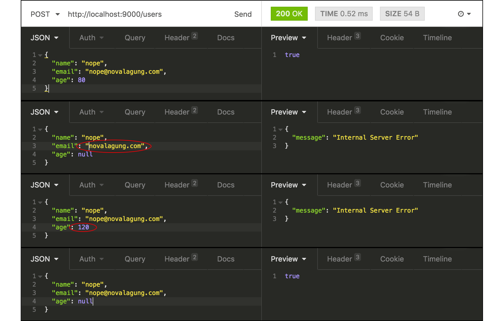

# C.5. HTTP Request Payload Validation (Validator v9, Echo)

Pada chapter ini kita akan belajar cara validasi payload request di sisi back end. Library yang kita gunakan adalah [github.com/go-playground/validator/v10](https://github.com/go-playground/validator), library ini sangat berguna untuk keperluan validasi data.

## C.5.1. Payload Validation

Penggunaan validator cukup mudah, di struct penampung payload, tambahkan tag baru pada masing-masing property dengan skema `validate:"<rules>"`.

Langsung saja kita praktekan, buat folder projek baru dengan isi file `main.go`, lalu tulis kode berikut ke dalamnya.

```go
package main

import (
    "github.com/labstack/echo"
    "github.com/go-playground/validator/v10"
    "net/http"
)

type User struct {
    Name  string `json:"name"  validate:"required"`
    Email string `json:"email" validate:"required,email"`
    Age   int    `json:"age"   validate:"gte=0,lte=80"`
}
```

Struct `User` memiliki 3 field, berisikan aturan/rule validasi, yang berbeda satu sama lain (bisa dilihat pada tag `validate`). Kita bahas validasi per-field agar lebih mudah untuk dipahami.

 - Field `Name`, tidak boleh kosong.
 - Field `Email`, tidak boleh kosong, dan isinya harus dalam format email.
 - Field `Age`, tidak harus di-isi; namun jika ada isinya, maka harus berupa numerik dalam kisaran angka 0 hingga 80.

Kurang lebih berikut adalah penjelasan singkat mengenai beberapa rule yang kita gunakan di atas.

 - Rule `required`, menandakan bahwa field harus di isi.
 - Rule `email`, menandakan bahwa value pada field harus dalam bentuk email.
 - Rule `gte=n`, artinya isi harus numerik dan harus di atas `n` atau sama dengan `n`.
 - Rule `lte=n`, berarti isi juga harus numerik, dengan nilai di bawah `n` atau sama dengan `n`.

Jika sebuah field membutuhkan dua atau lebih rule, maka tulis kesemuanya dengan delimiter tanda koma (`,`).

OK, selanjutnya buat struct baru `CustomValidator` dengan isi sebuah property bertipe `*validator.Validate` dan satu buah method ber-skema `Validate(interface{})error`. Objek cetakan struct ini akan kita gunakan sebagai pengganti default validator milik echo.

```go
type CustomValidator struct {
    validator *validator.Validate
}

func (cv *CustomValidator) Validate(i interface{}) error {
    return cv.validator.Struct(i)
}

func main() {
    e := echo.New()
    e.Validator = &CustomValidator{validator: validator.New()}

    // routes here

    e.Logger.Fatal(e.Start(":9000"))
}
```

Method `.Struct()` milik `*validator.Validate`, digunakan untuk mem-validasi data objek dari struct. 

> Library validator menyediakan banyak sekali cakupan data yang bisa divalidasi, tidak hanya struct, lebih jelasnya silakan lihat di laman github https://github.com/go-playground/validator.

Siapkan sebuah endpoint untuk keperluan testing. Dalam endpoint ini method `Validate` milik `CustomValidator` dipanggil.

```go
e.POST("/users", func(c echo.Context) error {
    u := new(User)
    if err := c.Bind(u); err != nil {
        return err
    }
    if err := c.Validate(u); err != nil {
        return err
    }

    return c.JSON(http.StatusOK, true)
})
```

OK, jalankan aplikasi, lakukan testing.



Bisa dilihat pada gambar di atas, ada beberapa request yang mengembalikan error.

 - Request pertama adalah valid.
 - Request ke-2 error karena value dari field `email` tidak valid. Harusnya berisi value dalam format email.
 - Request ke-3 error karena value field `age` lebih dari 80. Value seharusnya numerik kisaran 0 hingga 80.
 - Sedangkan request ke-4 sukses meskipun `age` adalah `null`, hal ini karena rule untuk field tersebut tidak ada `required`.

> Field `Age` tidak harus di-isi; namun jika ada isinya, maka harus berupa numerik dalam kisaran angka 0 hingga 80.

Dari testing di atas bisa kita simpulkan bahwa fungsi validasi berjalan sesuai harapan. Namun masih ada yang kurang, ketika ada yang tidak valid, error yang dikembalikan selalu sama, yaitu message `Internal server error`. 

Sebenarnya error 500 ini sudah sesuai jika muncul pada page yang sifatnya menampilkan konten. Pengguna tidak perlu tau secara mendetail mengenai detail error yang sedang terjadi. Mungkin dibuat saja halaman custom error agar lebih menarik.

Tapi untuk web service (RESTful API?), akan lebih baik jika errornya detail (terutama pada fase development), agar aplikasi consumer bisa lebih bagus dalam meng-handle error tersebut.

Nah, pada chapter selanjutnya kita akan belajar cara membuat custom error handler untuk meningkatkan kualitas error reporting.

---

 - [Echo](https://github.com/labstack/echo), by Vishal Rana (Lab Stack), MIT license
 - [Validator v9](https://github.com/go-playground/validator/tree/v9), by Dean Karn (Go Playground), MIT license

---

<div class="source-code-link">
    <div class="source-code-link-message">Source code praktek chapter ini tersedia di Github</div>
    <a href="https://github.com/novalagung/dasarpemrogramangolang-example/tree/master/chapter-C.5-http-request-payload-validation">https://github.com/novalagung/dasarpemrogramangolang-example/.../chapter-C.5...</a>
</div>
