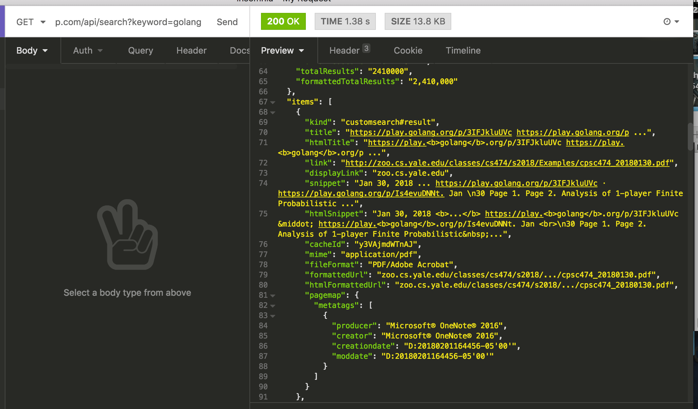
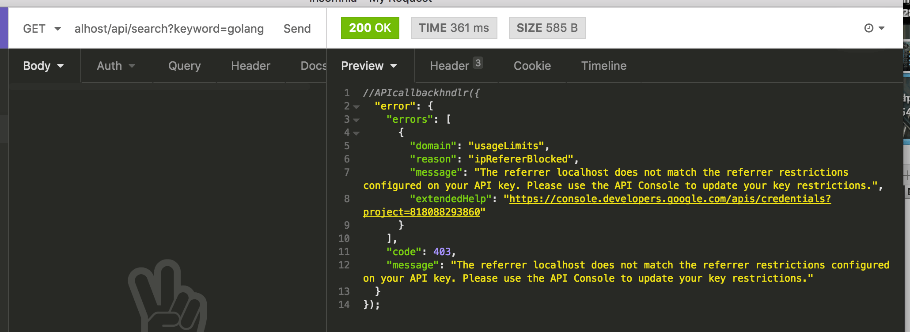
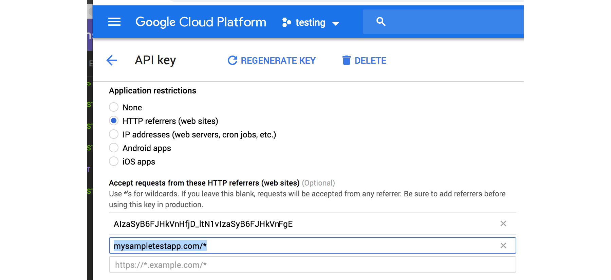

# D.2. Google API Search Dengan Timeout

Pada bab ini kita akan mencoba studi kasus yaitu membuat web service API untuk *wrap* pencarian ke Google Search API.

Proses pembelajaran dilakukan dengan praktek membuat sebuah aplikasi web service kecil, yang tugasnya melakukan pencarian data. Nantinya akan dibuat juga middleware `MiddlewareUtility`, tugasnya menyisipkan informasi origin dispatcher request, ke dalam context request, sebelum akhirnya sampai pada handler endpoint yg sedang diakses.

## D.2.1. Context Value

Ok, langsung saja, siapkan folder projek projek baru dengan struktur seperti berikut.

```bash
mkdir chapter-d2
cd chapter-d2
go mod init chapter-d2

# then prepare underneath structures
tree .
.
├── main.go
└── middleware.go

0 directories, 2 files
```

Pada file `middleware.go` isi dengan `CustomMux` yang pada bab-bab sebelumnya sudah pernah kita gunakan.

```go
package main

import "net/http"

type CustomMux struct {
	http.ServeMux
	middlewares []func(next http.Handler) http.Handler
}

func (c *CustomMux) RegisterMiddleware(next func(next http.Handler) http.Handler) {
	c.middlewares = append(c.middlewares, next)
}

func (c *CustomMux) ServeHTTP(w http.ResponseWriter, r *http.Request) {
	var current http.Handler = &c.ServeMux

	for _, next := range c.middlewares {
		current = next(current)
	}

	current.ServeHTTP(w, r)
}
```

Lalu pada file `main.go`, buat satu buah endpoint `/api/search`, dengan isi handler menampilkan data `from` yang diambil dari request context. Data `from` ini di set ke dalam request context oleh middleware `MiddlewareUtility`.

```go
package main

import (
	"context"
	"fmt"
	"net/http"
)

type M map[string]interface{}

func main() {
	mux := new(CustomMux)
	mux.RegisterMiddleware(MiddlewareUtility)

	mux.HandleFunc("/api/search", func(w http.ResponseWriter, r *http.Request) {
		from := r.Context().Value("from").(string)
		w.Write([]byte(from))
	})

	server := new(http.Server)
	server.Handler = mux
	server.Addr = ":80"

	fmt.Println("Starting server at", server.Addr)
	server.ListenAndServe()
}
```

Cara mengakses context request adalah lewat method `.Context()` milik objek request. Lalu chain dengan method `Value()` untuk mengambil data sesuai dengan key yang disisipkan pada parameter.

Untuk sekarang, tugas dari endpoint `/api/search` hanya menampilkan data tersebut, tidak lebih.

Selanjutnya siapkan middleware `MiddlewareUtility`. Di dalamnya, ada pengecekan header `Referer`, jika ada maka dijadikan value data `from` (yang kemudian disimpan pada context); sedangkan jika tidak ada maka value-nya berasal dari property `.Host` milik objek request.

```go
func MiddlewareUtility(next http.Handler) http.Handler {
    return http.HandlerFunc(func(w http.ResponseWriter, r *http.Request) {
        ctx := r.Context()
        if ctx == nil {
            ctx = context.Background()
        }

        from := r.Header.Get("Referer")
        if from == "" {
            from = r.Host
        }

        ctx = context.WithValue(ctx, "from", from)

        requestWithContext := r.WithContext(ctx)
        next.ServeHTTP(w, requestWithContext)
    })
}
```

Objek request context bisa didapat lewat pengaksesan method `.Context()` milik `*http.Request`. Objek ini bertipe `context.Context` dengan zero type adalah `nil`.

Pada kode di atas, jika context adalah `nil`, maka di-inisialisasi dengan context baru lewat `context.Background()`.

Objek `ctx` yang merupakan `context.Context` disini kita tempeli data `from`. Cara melakukannya dengan memanggil statement `context.WithValue()` dengan disisipi 3 buah parameter.

 1. Parameter ke-1, isinya adalah objek context.
 2. Parameter ke-2, isinya key dari data yang akan disimpan.
 3. Parameter ke-3, adalah value data yang akan disimpan.

Fungsi `.WithValue()` di atas mengembalikan objek context, isinya adalah objek context yang disisipkan di parameter pertama pemanggilan fungsi, tapi sudah disisipi data dengan key dari parameter ke-2 dan value dari parameter ke-3. Jadi tampung saja objek context kembalian statement ini ke objek yang sama, yaitu `ctx`.

Ok, sekarang objek `ctx` sudah dimodifikasi. Objek ini perlu untuk ditempelkan lagi ke objek request. Caranya dengan mengakses method `.WithContext()` milik objek request, lalu gunakan nilai baliknya pada `next.ServeHTTP()`.

Jalankan aplikasi, hasilnya kurang lebih seperti gambar berikut.


O iya, penulis tidak menggunakan `http://localhost` untuk mengakses aplikasi, melainkan menggunakan `http://mysampletestapp.com`, dengan catatan domain ini sudah saya arahkan ke 127.0.0.1.


Ok, untuk sekarang sepertinya cukup jelas mengenai penggunaan context pada objek http request. Tinggal kembangkan saja sesuai kebutuhan, seperti contohnya: context untuk menyimpan data session, yang diambil dari database sessuai dengan session id nya.

## D.2.2. Context Timeout & Cancellation

Melanjutkan program yang sudah dibuat, nantinya pada endpoint `/api/search` akan dilakukan sebuah pencarian ke Google sesuai dengan keyword yang diinginkan. Pencarian dilakukan dengan memanfaatkan [Custom Search JSON API](https://developers.google.com/custom-search/json-api/v1/overview) milik Google.

Sekarang ubah isi handler endpoint tersebut menjadi seperti berikut.

```go
mux.HandleFunc("/api/search", func(w http.ResponseWriter, r *http.Request) {
	ctx := r.Context()

	keyword := r.URL.Query().Get("keyword")
	chanRes := make(chan []byte)
	chanErr := make(chan error)

	go doSearch(ctx, keyword, chanRes, chanErr)

	select {
	case res := <-chanRes:
		w.Header().Set("Content-type", "application/json")
		w.Write(res)
	case err := <-chanErr:
		http.Error(w, err.Error(), http.StatusInternalServerError)
	}
})
```

Proses pencarian dilakukan secara *asynchronous* lewat fungsi `doSearch()` yang nantinya akan kita buat. Pemanggilannya menggunakan keyword `go` dan disisipkan beberapa parameter yang dua diantaranya bertipe channel.

 - Channel `chanRes`, digunakan jika proses pencarian sukses. Data hasil pencarian dilempar ke main routine lewat channel ini, untuk kemudian diteruskan sebagai response endpoint
 - Channel `chanErr`, digunakan untuk pass objek error, jika memang terjadi error.

Ok, lanjut, siapkan dua buah konstanta baru.

 - Konstanta `SEARCH_MAX_DURATION`, digunakan untuk menge-set max response time. Jika melebihi, maka request langsung di-cancel.
 ```go
 var SEARCH_MAX_DURATION = 4 * time.Second
 ```

 - Konstanta `GOOGLE_SEARCH_API_KEY`, ini merupakan API key yang diperlukan dalam penggunaan Custom Search API. Silakan merujuk ke laman [Google Cloud Platform](https://console.cloud.google.com/apis/dashboard) untuk mendapatkan API key.
 ```go
 var GOOGLE_SEARCH_API_KEY = "ASSVnHfjD_ltXXXXSyB6WWWWWWWWveMFgE"
 ```

Sekarang kita mulai masuk ke bagian pembuatan fungsi pencarian `doSearch()`. Silakan tulis kode berikut.

```go
func doSearch(
	ctx context.Context,
	keyword string,
	chanRes chan []byte,
	chanErr chan error,
) {
	innerChanRes := make(chan []byte)
	innerChanErr := make(chan error)

	url := "https://www.googleapis.com/customsearch/v1"
	url = fmt.Sprintf("%s?key=%s", url, GOOGLE_SEARCH_API_KEY)
	url = fmt.Sprintf("%s&cx=017576662512468239146:omuauf_lfve", url)
	url = fmt.Sprintf("%s&callback=hndlr", url)
	url = fmt.Sprintf("%s&q=%s", url, keyword)

	from := ctx.Value("from").(string)

	// ...
}
```

Di dalam fungsi tersebut, `url` pencarian dibentuk, data API key dan keyword pencarian disisipkan. Selain itu disiapkan pula `innerChanRes` dan `innerChanErr` yang kegunaannya mirip seperti objek channel yang disisipkan pada pemanggilan fungsi, hanya saja dua channel baru ini digunakan hanya dalam fungsi ini saja.

Lanjut tulis kode berikut.

```go
ctx, cancel := context.WithTimeout(ctx, SEARCH_MAX_DURATION)
defer cancel()

req, err := http.NewRequest("GET", url, nil)
if err != nil {
	innerChanErr <- err
	return
}

req = req.WithContext(ctx)
req.Header.Set("Referer", from)

transport := new(http.Transport)
client := new(http.Client)
client.Transport = transport
```

Objek `ctx` yang di-pass dari luar, dibungkus lagi menggunakan `context.WithTimeout()`. Fungsi ini mengembalikan objek context yang sudah ditambahi data deadline. Tepat setelah statement ini dieksekusi, dalam durasi `SEARCH_MAX_DURATION` context akan di-cancel.

> Pengesetan deadline context bisa dilakukan lewat `context.WithTimeout()`, atau bisa juga lewat `context.WithDeadline()`. Perbedaannya pada fungsi `.WithDeadline()` parameter yang disisipkan bertipe `time.Time`.

Disiapkan juga objek `req` yang merupakan objek request. Objek ini dibungkus menggunakan `req.WithContext()` dengan isi parameter objek `ctx`, menjadikan objek context yang sudah kita buat tertempel pada request ini. Kegunaannya nanti akan dibahas.

Selain itu, data `from` yang didapat dari request context disisipkan sebagai request header pada objek `req`.

Disiapkan juga objek `transport` yang bertipe `*http.Transport` dan objek `client` yang bertipe `*http.Client`.

Setelah ini, tulis kode untuk dispatch request yang sudah dibuat lalu handle response nya. Jalankan proses-nya sebagai goroutine.

```go
go func() {
	resp, err := client.Do(req)
	if err != nil {
		innerChanErr <- err
		return
	}

	if resp != nil {
		defer resp.Body.Close()
		resData, err := ioutil.ReadAll(resp.Body)
		if err != nil {
			innerChanErr <- err
			return
		}
		innerChanRes <- resData
	} else {
		innerChanErr <- errors.New("No response")
	}
}()
```

Request di-trigger lewat statement `client.Do(req)`. Jika menghasilkan error, maka kirim informasi errornya ke channel `innerChanErr`. Cek juga objek response hasil request tersebut, jika kosong maka lempar sebuah error ke channel yang sama.

Baca response body, jika tidak ada masalah, lempar result-nya ke channel `innerChanRes`.

Selanjutnya, kita lakukan pengecekan menggunakan teknik `select case` untuk mengetahui channel mana yang menerima data.

```go
select {
case res := <-innerChanRes:
	chanRes <- res
	return
case err := <-innerChanErr:
	transport.CancelRequest(req)
	chanErr <- err
	return
case <-ctx.Done():
	transport.CancelRequest(req)
	chanErr <- errors.New("Search proccess exceed timeout")
	return
}
```

Silakan perhatikan kode di atas, kita akan bahas 2 `case` pertama.

 - Jika channel `innerChanRes` mendapati kiriman data, maka langsung diteruskan ke channel `chanRes`.
 - Jika channel `innerChanErr` mendapati kiriman data, maka langsung diteruskan ke channel `chanErr`. Tak lupa cancel request lewat method `transport.CancelRequest(req)`, ini diperlukan karena request gagal.

Untuk case terakhir `case <-ctx.Done()`, penjelasannya agak sedikit panjang. Objek context, memiliki method `ctx.Done()` yang mengembalikan channel. Channel ini akan melewatkan data jika deadline timeout context-nya terpenuhi. Dan jika itu terjadi, pada kode di atas langsung dikembalikan sebuah error ke channel `chanErr` dengan isi error `Search proccess exceed timeout`; tak lupa request-nya juga di-cancel.

Request perlu di-cancel karena jika waktu sudah mencapai deadline context (yaitu `SEARCH_MAX_DURATION`), pada saat tersebut bisa saja request belum selesai, maka dari itu request perlu di-cancel.

Jika di-summary, maka yang dilakukan oleh fungsi `doSearch` kurang lebih sebagai berikut sebagai berikut.

 - Jika request pencarian tak lebih dari `SEARCH_MAX_DURATION`:
	- Jika hasilnya sukses, maka kembalikan response body lewat channel `chanRes`.
	- Jika hasilnya gagal, maka kembalikan error-nya lewat channel `chanErr`.
 - Jika request pencarian lebih dari `SEARCH_MAX_DURATION`, maka dianggap *timeout*, langsung lempar error timeout ke channel `chanErr`.

Jalankan, lihat hasilnya.



Informasi tambahan: best practice mengenai cancelation context adalah untuk selalu menambahkan `defer cancel()` setelah (cancelation) context dibuat. Lebih detailnya silakan baca https://blog.golang.org/context.

## D.2.3. Google Search API Restrictions Referer

Di bagian awal bab ini, kita belajar mengenai context value. Kenapa penulis memilih menggunakan context untuk menyisipkan data referer, kenapa tidak contoh yg lebih umum seperti session dan lainnya? sebenarnya ada alasannya.

Silakan coba akses kedua url berikut.

 - http://mysampletestapp.com/api/search?keyword=golang
 - http://localhost/api/search?keyword=golang

Harusnya yang dikembalikan sama, tapi kenyataannya pengaksesan lewat url `localhost` menghasilkan error.



Error message:

<pre style="font-size: .85em; white-space: pre-wrap; white-space: -moz-pre-wrap; white-space: -pre-wrap; white-space: -o-pre-wrap; word-wrap: break-word;">The referrer localhost does not match the referrer restrictions configured on your API key. Please use the API Console to update your key restrictions.</pre>

Error di atas muncul karena, host `localhost` belum didaftarkan pada API console. Berbeda dengan `mysampletestapp.com` yang sudah didaftarkan, host ini berhak mengakses menggunakan API key yang kita gunakan.



---

<div class="source-code-link">
    <div class="source-code-link-message">Source code praktek pada bab ini tersedia di Github</div>
    <a href="https://github.com/novalagung/dasarpemrogramangolang-example/tree/master/chapter-D.2-google-api-search/2-request-cancellation">https://github.com/novalagung/dasarpemrogramangolang-example/...</a>
</div>
